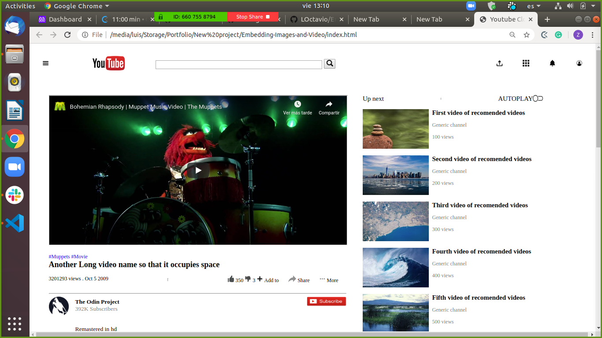

# Project Name

> It is a clone of youtube.

## Built With

- HTML
- CSS

## Live Demo

[Live Demo Link](https://livedemo.com)

### Prerequisites

Navigation bar
-It has an embedded image that represents a logo.
-The logo is aligned to the leftmost part of the navbar.
-It has an input tag that represents a search bar.
-The search bar is aligned to the middle of the navbar.
-It has a button tag that represents the search button.
-The search button is at the end (rightmost part) of the search bar.
-It has at least three embedded images on the rightmost part of the navbar that represent icons and/or an avatar.
Video
-It is displayed.
-It shows the video title.
-It shows the number of views.
-It has like and dislike icons.
-It has a share button.
-It shows the avatar of the user who uploaded the video.
-It has a subscribe button.
Sidebar Recommended videos
-It shows the recommended video’s thumbnail preview (as image not as an actual video).
-It shows the title of the video.
-It shows the number of views.

### Setup

### Install

### Usage

### Run tests

### Deployment

## Authors

👤 Luis Octavio Ramirez Cruz

- Github: [@LOctavio](https://github.com/LOctavio)
- Twitter: [@Octavio_ram431](https://twitter.com/Octavio_ram431)
- Linkedin: [linkedin](https://www.linkedin.com/in/luis-octavio-ramirez-cruz-714521178/)

👤 Ishan chawla 

- Github: [@ishanchawla1](https://github.com/gishanchawla1)
- Twitter: [@Ishanchawla1884](https://twitter.com/Ishanchawla1884)
- Linkedin: [linkedin](https://www.linkedin.com/in/ishan-chawla-232988b5/)

## 🤝 Contributing

Contributions, issues and feature requests are welcome!

Feel free to check the [issues page](issues/).

## Show your support

Give a ⭐️ if you like this project!

## Acknowledgments

- Hat tip to anyone whose code was used
- Inspiration
- etc

## 📝 License

This project is [MIT](lic.url) licensed.
